

<!-- PROJECT LOGO -->
 

## **Food Station**
  

    Hali shop is another practice app. this app like e-commerce type.  I have learn more things from this project
     
    

  
      

    <a href="https://github.com/RootHex200/Hali-Shop-app/issues">Report Bug</a>
    ·
    <a href="https://github.com/RootHex200/Hali-Shop-app/issues">Request Feature</a>
  

<!-- TABLE OF CONTENTS -->

  
Table of Contents

  <ol>
    <li>
      <a href="#about-the-project">About The Project</a>
      <ul>
        <li><a href="#features-with-snapshots">Features with Snapshots</a></li>
        <li><a href="#built-with">Built With</a></li>
      </ul>
    <li><a href="#roadmap">Roadmap</a></li>
   
  </ol>

<!-- ABOUT THE PROJECT -->
## About The Project

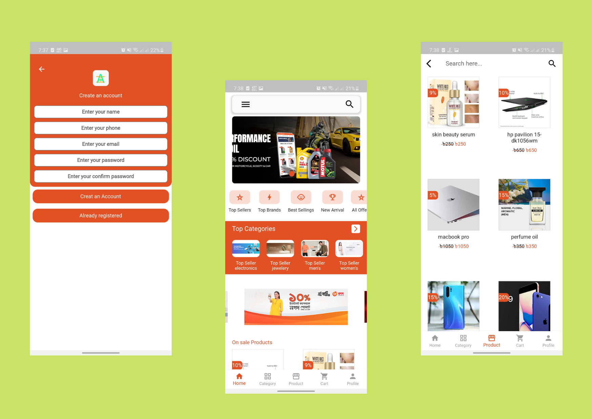

 
Hali shop is android app version.this is another practice project.The app was made with Flutter as a Frontend technology and Node js epxress as a backend . User can CURD operation

(<a href="#top">back to top</a>)

## Features with Snapshots
1. User Login and Registers.
   

snapshot

   
    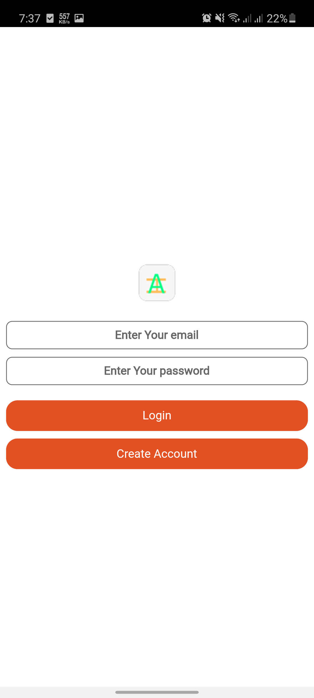 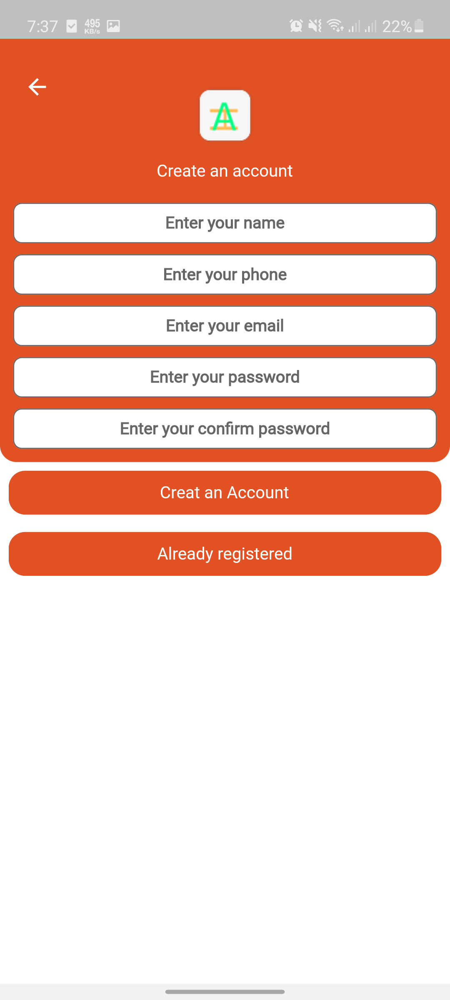

   

2. home page
   

snapshot

    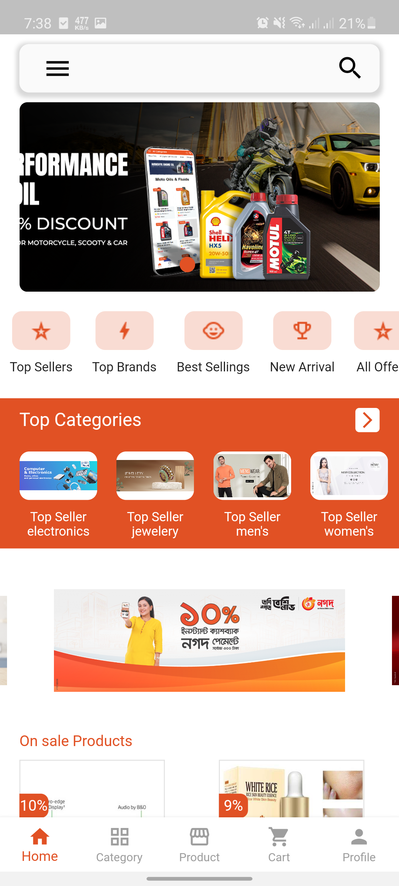 
   

3. Add to Cart 
   

snapshot

   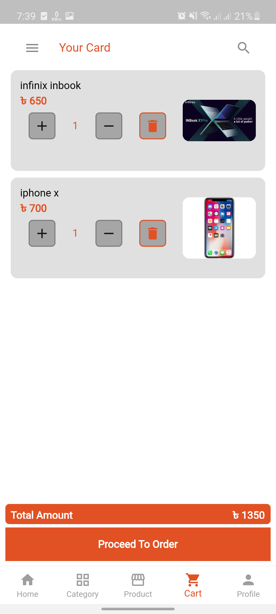

   

4. Product Details page
   

snapshot

   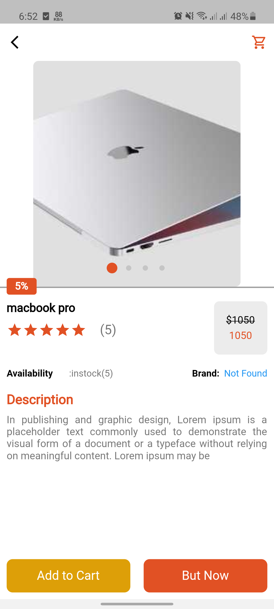

   

5. Product page and search product page
   

snapshot

   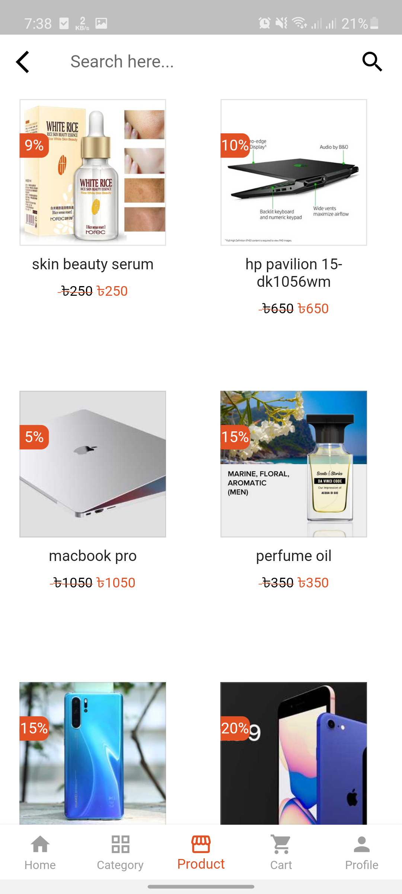 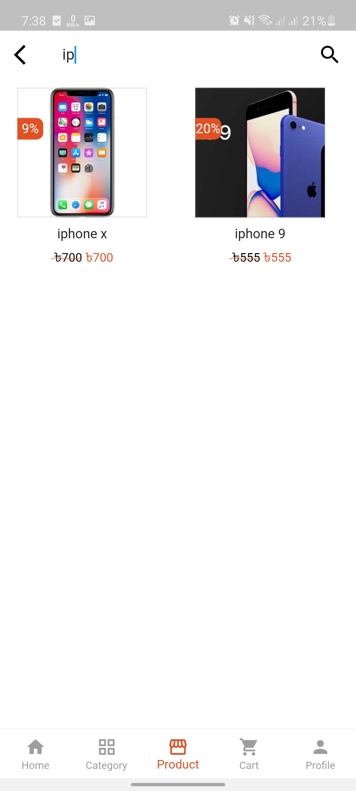

   

6. User setting
   

snapshot

   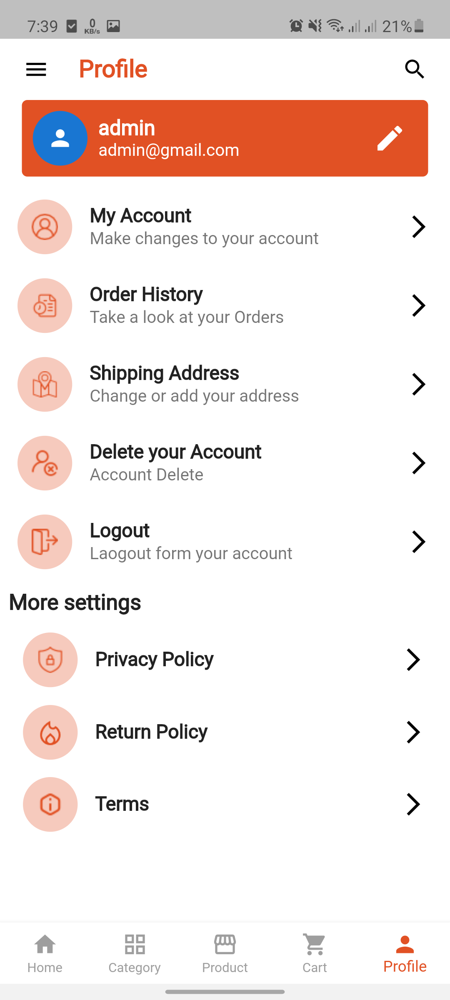

   

6. Payment gateway
   

snapshot

   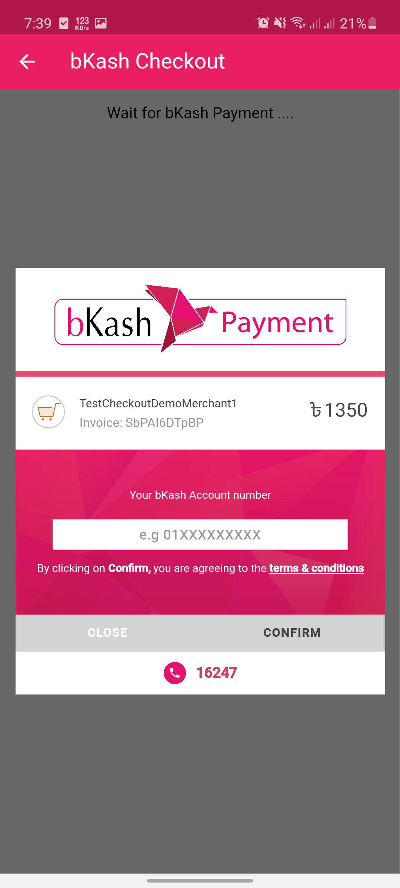 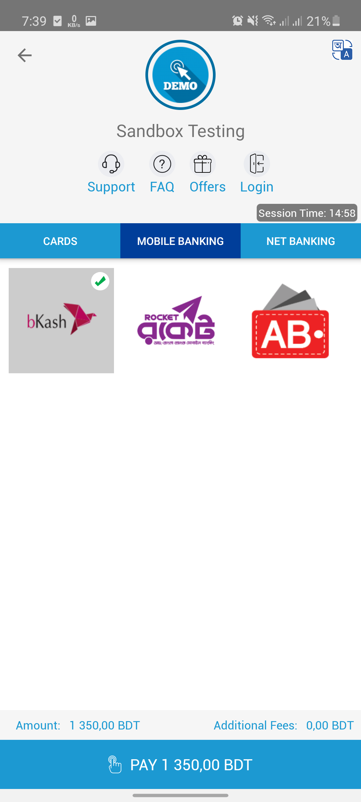

   

6. Logout
   

snapshot

   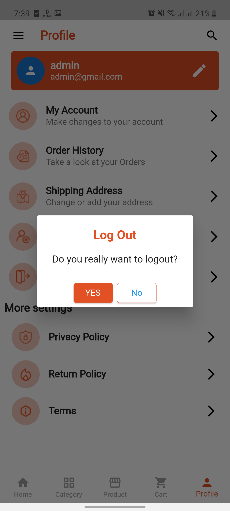

   

## Built With 
#### Frontend Technology  
* [Flutter](https://flutter.dev/?gclsrc=ds&gclsrc=ds)  
Features and Plugins I've used: 
   - REST api
   - Riverpod

  
   
* Demo video link: https://drive.google.com/file/d/1S6LpaHxbrwp68DeG-eQjMUd7tMP8nI50/view?usp=share_link

(<a href="#top">back to top</a>)

## Prerequisites

######
* **Flutter**

  Flutter has a greate [documentation](https://docs.flutter.dev/get-started/install) for enviroment setup 

## Roadmap
#### Frontend
- [x] create 9 screen
    - [x] first 1 screen for splash screen
    - [x] second screen for sign in and sign up
    - [x] 3rd screen for homepage
    - [x] 5rd screen show product data 
    - [x] 6th screen show product detials data
    - [x] 7th screen show user settings
    - [x] 8th screen for checkout page
    - [x] 9th screen Add to cart page
- [x]  take information from sign in and sign up(create new user) page and send it to thought api(server)
- [x] get data(product data) from server(api) and show in home page and product page
- [x] user can search product
- [x] click for product details then navigate to details page carry all product  data by constructor and show data in detials page
- [x] click setting then navigate to setting page. where user can update they are info and logout account
- [x] click process to oder then get checkout page of payment gateway baksh and SSLCOMMERZ
- [x] click add to cart page then get cart data from Rest api when user click add to cart options and in this cart page user can update product value. and user can't added same data in cart 

# MORE FEATURES IS UNDER DEVELOPING

(<a href="#top">back to top</a>)
